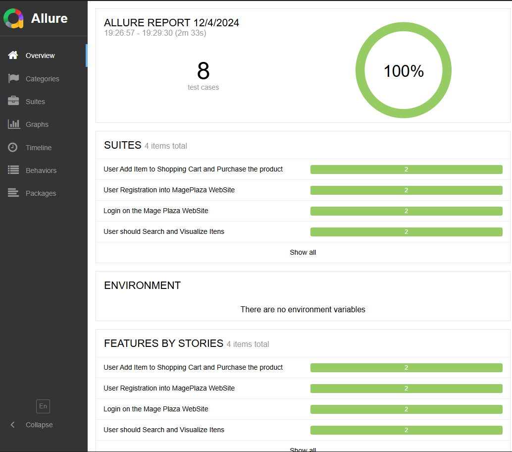

# 🎓 Certificação Rumos Expert: Test Automation Engineer

Para obter a certificação final do curso, o desafio era escolher um site de e-commerce e escrever um conjunto de testes automatizados usando as ferramentas aprendidas durante o curso.

## 🔧 Ferramentas utilizadas neste projeto

* **IDE:** IntelliJ IDEA
* **Frameworks:** Selenium, Cucumber, TestNG
* **Relatórios de teste:** Allure Report
* **Linguagem de programação:** Java
* **Ferramenta de build:** Maven
* **Repositório:** GitHub

## 💻 Site de e-commerce escolhido para teste

* https://magento-demo.mageplaza.com/

## 📑 Pré-requisitos para este projeto

Para replicar este projeto, você precisa:

* JDK 21
* Maven 3.9.9
* IDE compatível com Selenium (IntelliJ IDEA, Eclipse)
* TestNG e Cucumber instalados na sua IDE
* Allure instalado na sua máquina (se ainda não estiver)
* Jenkins e Git instalados na sua máquina (opcional)

## 🏆 Objetivo dos testes

O objetivo é validar as seguintes funcionalidades:

- Registro de utilizador
- Login de usuário
- Busca e visualização de produtos
- Adicionar produto ao carrinho de compras
- Compra de um item

## 💪 Começando com os testes

### Lógica por trás da execução dos testes

Os testes são executados em paralelo nos navegadores Chrome e Firefox, utilizando o modo headless para maior velocidade e eficiência. O Cucumber e o TestNG são usados em conjunto para organizar e executar os testes, enquanto o Allure Report gera relatórios detalhados sobre os resultados dos testes.

### Executando os testes em modo Headless

Para executar os testes sem abrir o navegador, você pode usar o modo headless do Chrome e do Firefox. Para isso, o projeto já está configurado para executar em modo `headless`.

## **Chrome:**

Java
ChromeOptions options = new ChromeOptions();
options.addArguments("--headless=new"); // Use --headless=new para Chrome 110+
WebDriver driver = new ChromeDriver(options);
Use o código com cuidado.

## **Firefox:**

Java
FirefoxOptions options = new FirefoxOptions();
options.addArguments("--headless");
WebDriver driver = new FirefoxDriver(options);
Use o código com cuidado.

### **Executando os testes**

No terminal, execute os seguintes comandos:

Bash
mvn clean install - Para instalar as dependências e executar os testes
mvn clean test - Para executar todos os testes
Use o código com cuidado.

Gerando os relatórios
Gerar relatório Allure:

Bash
mvn allure:report
Use o código com cuidado.

### **Abrir relatório no navegador:**

Bash
mvn allure:serve
Use o código com cuidado.

### **Test Runner**

Para executar um teste de cada vez, você precisará executar pelo Cucumber na IDE.

Todos os testes são independentes, você pode executar cada um ou executar o conjunto completo de testes.

### 💡 **Organização do projeto**

O projeto utiliza o Page Object Model (POM) para organizar o código e reduzir a duplicação. Cada funcionalidade a ser testada é implementada de forma independente, permitindo que todos os testes sejam executados de forma independente e que o código seja reutilizado.

Diferentes arquivos de features foram criados para testar diferentes funcionalidades, cada um com seus próprios casos de teste e cenários.

O arquivo BrowserConfig.java configura os navegadores (Chrome, Firefox e Edge) e gerencia a instanciação e inicialização do WebDriver.

### 📝 **Exemplo de feature:**

O cenário abaixo, escrito em Gherkin, testa o login de usuário com sucesso. Ele usa Scenario Outline para especificar diferentes conjuntos de dados para o teste.

Gherkin
Feature: Login on the Mage Plaza WebSite

Background:
Given I am on the homepage

Scenario Outline: Login on the mage plaza with <browser>
When I navigate to the Sign In page
And I fill in the "<email>" and "<password>"
Then I click on the Sign In button
And I should be logged in successfully
And I click on the logOut button

    Examples:
      | browser | email                     | password  |
      | chrome  | kesaralija@mailinator.com | Pa$$w0rd! |
      | firefox | gugeja@mailinator.com     | Pa$$w0rd! |
      
Use o código com cuidado.

### 🚩 **Tratamento de erros**

Durante o desenvolvimento, foi encontrado um erro em um navegador específico, onde as informações eram enviadas muito rápido e o navegador não conseguia detectar o que estava sendo digitado. Para solucionar esse problema, foi utilizado Thread.sleep() para dar tempo ao navegador de processar as informações. No entanto, a melhor prática para lidar com esse tipo de situação é usar esperas explícitas (WebDriverWait) para esperar que os elementos estejam disponíveis antes de interagir com eles.

# 📢 **Contribuições**

Contribuições são bem-vindas! Sinta-se à vontade para contribuir com melhorias ou sugestões.

# 🙆‍♀️ **Autor**

## Nome: João Aquino
## LinkedIn: linkedin.com/in/jmfaquino
